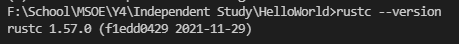
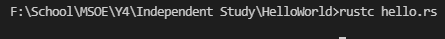
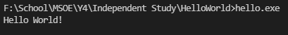

# rust-hello-world

Author: Paul Rinaldi  
Purpose: Learning Rust for Solana Development

## To install Rust

Follow the installation instructions here [https://www.rust-lang.org/tools/install](https://www.rust-lang.org/tools/install)

Check the version `rustc --version`

## Build instructions

`rustc hello.rs`

## Run instruction

Double click the exe or run `hello.exe` in the cmd in this directory.

